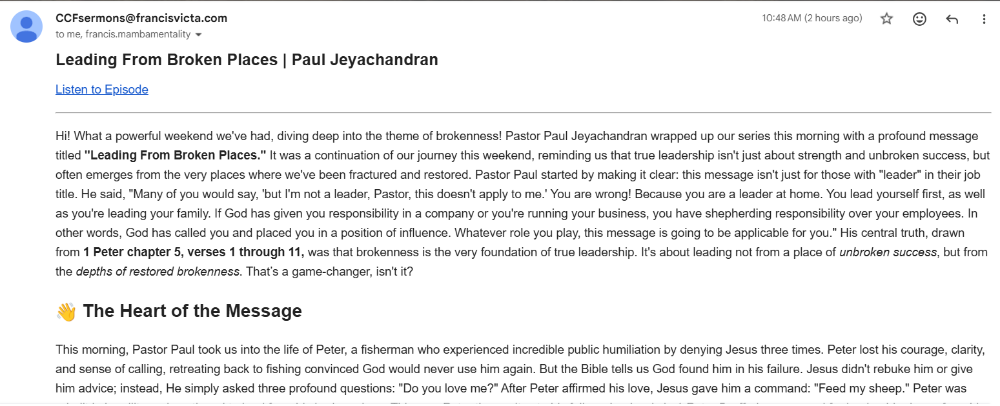

# Weekly Automated Sermon Summarizer (CCF Podcast)

AWS Lambda that checks the **latest CCF sermon podcast** entries, downloads the audio, summarizes them with Gemini AI (gemini-2.5-flash) via the Google GenAI Python SDK, and emails the summaries to configured recipients. A DynamoDB table is used to prevent re-processing the same episode.

## Why I Built This
I’ve been quite busy lately and haven’t always been able to catch the weekly CCF sermons live. I still want to stay aware of the message, so I built an automated solution that summarizes the sermon and emails it directly to me and my wife. This lets us stay informed and learn from each week’s teaching without missing the core message.

## What It Does
- Polls the CCF podcast RSS feed for the latest episodes (via EventBridge).
- Downloads the sermon audio (MP3).
- Uploads the sermon audio to Gemini and summarizes it directly from the audio file.
- Emails each sermon summary via AWS SES (one email per sermon).
- Stores the episode ID in DynamoDB so it only runs once per episode.

## Sample Output
Processed MP3:
https://anchor.fm/s/15ae74cc/podcast/play/114855654/https%3A%2F%2Fd3ctxlq1ktw2nl.cloudfront.net%2Fstaging%2F2026-1-1%2F1b887726-e4af-c122-882f-61bd429eb1a5.mp3

Screenshot of the generated summary email:


## Architecture (High Level)
1. **AWS EventBridge** → triggers the Lambda on Sundays (can run multiple times)
2. **Podcast RSS** → latest episode metadata + audio URL
3. **Sermon Filter** → match Sunday sermons by title date + publish date
4. **Gemini (audio upload)** → generate summary from the attached audio file
5. **AWS SES** → email delivery (one per sermon)
6. **AWS DynamoDB** → deduplication of processed episodes

### Sunday Multi-Trigger Flow (Idempotent)
The Lambda can be triggered multiple times on Sunday (e.g., 3–4 times) based on your EventBridge schedule (EST). Each run:
- Fetches the latest RSS entries (e.g., 10–20)
- Filters to sermons with **title date = trigger date (EST)** and **published date = same date**
- For each matching sermon:
  - If already in DynamoDB → skip
  - If new → summarize (from audio) + email + store in DynamoDB

If only one sermon is uploaded early, the first run sends that one. Later runs will pick up the second sermon once it appears, but already-sent sermons will not be reprocessed.

## Prerequisites
- Python 3.13+
- AWS account with:
  - **Lambda**
  - **DynamoDB** table
  - **SES** verified sender + permissions
  - **EventBridge**
- Gemini API key

## Environment Variables
Create a `.env` file for local testing (or set Lambda environment variables):

```bash
LOCAL_TEST_MODE=True
GEMINI_API_KEY=YOUR_GEMINI_API_KEY
GEMINI_MODEL=gemini-2.5-flash
PODCAST_RSS_URL=https://anchor.fm/s/15ae74cc/podcast/rss
SENDER_EMAIL=verified-ses-sender@example.com
RECIPIENT_EMAIL=recipient@example.com
DYNAMO_TABLE=CCFProcessedAudio
```

For multiple recipients, use a comma-separated list:
```bash
RECIPIENT_EMAILS=person1@example.com,person2@example.com,person3@example.com
```

To test a specific date on Lambda Test Function and not local test (e.g., last Sunday), add:
```bash
FORCE_DATE=2026-02-01
```
Remove `FORCE_DATE` to return to normal behavior (uses today's date in America/New_York).

### Notes
- `LOCAL_TEST_MODE=True` enables local mocks for DynamoDB + SES.
- `DYNAMO_TABLE` defaults to `CCFProcessedAudio` if not provided.
- In SES sandbox mode, all recipient emails must be verified.
- On Windows/local dev, install `tzdata` (included in requirements.txt) so `ZoneInfo("America/New_York")` works.

### Gemini Audio Processing Notes
- The Lambda uses the **Google GenAI Python SDK** (`google.genai`).
- It uploads the MP3 with `client.files.upload(...)` and passes the returned file handle into `client.models.generate_content(...)`.
- After the response is generated, the uploaded audio file is deleted via `client.files.delete(...)`.

## Install Dependencies
```bash
python -m venv .venv
source .venv/bin/activate
pip install -r requirements.txt
```

## Local Test (Lambda Flow)
Runs the full Lambda handler locally with mocked AWS services:

```bash
python lambda_function.py
```

Local testing does **not** require MongoDB. The code uses DynamoDB in AWS, and local mode mocks the DB and email sending.

## Manual Transcript/Summary Test
Use the helper script for testing a specific podcast episode:

```bash
python test_manual.py
```

Edit the episode URL or RSS entry inside `test_manual.py` to test a different sermon.

### Packaging and Deployment (bash/Linux)
Upload `deployment.zip` to Lambda or use AWS CLI if configured

```bash
# from repo root
rm -rf package deployment.zip
pip install -r requirements.txt -t package
cp lambda_function.py prompt.txt package/
cd package && python -m zipfile -c ../deployment.zip .
cd ..
```

### Packaging (Windows + Docker, Python 3.13)
Use this if you build on Windows but deploy to AWS Lambda (Linux). These commands create Linux-compatible wheels inside a Docker container that matches the Lambda runtime.

**Step 0 — Start Docker Desktop**
- Open Docker Desktop and wait until it shows **Running**.

**Optional (Git Bash) — One-step build script**
If you use Git Bash, run:
```bash
bash build_package.sh
```
This script deletes `package/` and `deployment.zip`, rebuilds the package, and creates a fresh zip.

**Step 1 — Build (install deps + copy code)**

Command Prompt (CMD):
```bat
docker run --rm -v "%cd%":/var/task --entrypoint /bin/bash public.ecr.aws/lambda/python:3.13 ^
  -c "pip install -r requirements.txt -t package && cp lambda_function.py prompt.txt package/"
```

PowerShell:
```powershell
docker run --rm -v ${PWD}:/var/task --entrypoint /bin/bash public.ecr.aws/lambda/python:3.13 `
  -c "pip install -r requirements.txt -t package && cp lambda_function.py prompt.txt package/"
```

**Step 2 — Zip**

Command Prompt (CMD):
```bat
docker run --rm -v "%cd%":/var/task --entrypoint /bin/bash public.ecr.aws/lambda/python:3.13 ^
  -c "cd package && python -m zipfile -c /var/task/deployment.zip ."
```

PowerShell:
```powershell
docker run --rm -v ${PWD}:/var/task --entrypoint /bin/bash public.ecr.aws/lambda/python:3.13 `
  -c "cd package && python -m zipfile -c /var/task/deployment.zip ."
```

**Notes**
- The container starts and stops automatically for each command. You do **not** keep it running.
- If only code changes (no dependency changes), you can skip Step 1 and run only Step 2.

### Deploy (AWS CLI)
```bash
aws lambda update-function-code \
  --function-name YOUR_FUNCTION_NAME \
  --zip-file fileb://deployment.zip
```

## Scheduling
This Lambda is intended to be triggered on a schedule using **Amazon EventBridge**. It is currently scheduled to run on Sundays (10am, 3pm, 9pm) and Mondays (10am, 3pm) to account for delayed uploads.

## Files of Interest
- `lambda_function.py` — Lambda entry point and main logic
- `prompt.txt` — Prompt template for Gemini
- `test_manual.py` — Manual transcript + summary test
- `requirements.txt` — Python dependencies

## Troubleshooting
- **No audio found**: ensure the podcast RSS entry has an `enclosure` with an MP3 URL.
- **SES errors**: ensure sender is verified and the Lambda role allows `ses:SendEmail`.
- **Already processed**: the episode ID is stored in DynamoDB and won’t be reprocessed.
