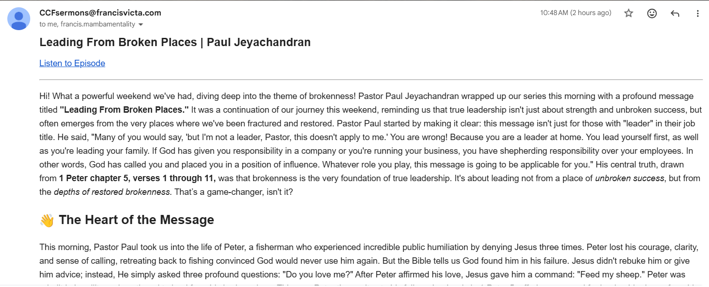

# Weekly Automated Sermon Summarizer (CCF Podcast)

AWS Lambda that checks the **latest CCF sermon podcast** entries, downloads the audio, summarizes them with Gemini AI (gemini-2.5-flash) via the Google GenAI Python SDK, and emails the summaries to configured recipients. A DynamoDB table is used to prevent re-processing the same episode.

## Why I Built This
I’ve been quite busy lately and haven’t always been able to catch the weekly CCF sermons live. I still want to stay aware of the message, so I built an automated solution that summarizes the sermon and emails it directly to me and my wife. This lets us stay informed and learn from each week’s teaching without missing the core message.

## What It Does
- Polls the CCF podcast RSS feed for the latest episodes (via EventBridge).
- Downloads the sermon audio (MP3).
- Uploads the sermon audio to Gemini and summarizes it directly from the audio file.
- **Narrates the summary with AI text-to-speech and publishes it as a private podcast feed**, so a ~1 hour sermon becomes a few minutes you can listen to in the car.
- Emails each sermon summary via AWS SES (one email per sermon), including a link to the audio.
- Stores the episode ID in DynamoDB so it only runs once per episode.

## Sample Output
Processed MP3:
https://anchor.fm/s/15ae74cc/podcast/play/114855654/https%3A%2F%2Fd3ctxlq1ktw2nl.cloudfront.net%2Fstaging%2F2026-1-1%2F1b887726-e4af-c122-882f-61bd429eb1a5.mp3

Screenshot of the generated summary email:


## Architecture (High Level)
1. **AWS EventBridge** → triggers the Lambda on Sundays (can run multiple times)
2. **Podcast RSS** → latest episode metadata + audio URL
3. **Sermon Filter** → match Sunday sermons by title date + publish date
4. **Gemini (audio upload)** → generate summary from the attached audio file
5. **Gemini TTS (or Amazon Polly)** → narrate the summary as an MP3
6. **AWS S3** → host the MP3 and a private podcast `feed.xml`
7. **AWS SES** → email delivery (one per sermon), with a link to the audio
8. **AWS DynamoDB** → deduplication of processed episodes + source of truth for the feed

### Sunday Multi-Trigger Flow (Idempotent)
The Lambda can be triggered multiple times on Sunday (e.g., 3–4 times) based on your EventBridge schedule (EST). Each run:
- Fetches the latest RSS entries (e.g., 10–20)
- Filters to sermons with **title date = trigger date (EST)** and **published date = same date**
- For each matching sermon:
  - If already in DynamoDB → skip
  - If new → summarize (from audio) + email + store in DynamoDB

If only one sermon is uploaded early, the first run sends that one. Later runs will pick up the second sermon once it appears, but already-sent sermons will not be reprocessed.

## Listen Instead of Read (Audio Summaries)

Reading the email is not always practical — but a commute is a perfect time to catch the message. After the summary is generated, the Lambda narrates it, uploads the MP3 to S3, and rebuilds a **private podcast feed**.

You subscribe to that feed once in a podcast app. From then on, each week's summary appears automatically next to your other shows, which means it plays over **CarPlay / Android Auto / Bluetooth** with steering-wheel controls — no fumbling with email attachments at a stoplight.

A typical summary runs about 4–7 minutes instead of the 60+ minute sermon.

### Why This Is Free
- **Gemini TTS** (default) runs on the Gemini API free tier and reuses the `GEMINI_API_KEY` you already have. A handful of sermons a month sits far inside the free limits.
- **S3** storage is roughly 3 MB per episode — about 150 MB a year, which costs well under a cent per month (and is covered by the 5 GB free tier for the first 12 months).
- **Amazon Polly** is offered as an alternative. Its neural free tier is 1M characters/month but only for the first 12 months; after that expect roughly $0.20–$0.70/month at this volume. Gemini is the better choice if "free" is the priority.

### Setup

**1. Create an S3 bucket** (any name, same region as your Lambda).

**2. Pick a secret prefix.** Podcast apps cannot log in or follow expiring links, so the feed has to be publicly readable. Its privacy comes from being unguessable — treat `AUDIO_PREFIX` like a password:

```bash
AUDIO_PREFIX=sermons-$(openssl rand -hex 8)
```

**3. Allow public reads of that prefix only.** In the bucket's *Permissions* tab, under *Block public access*, uncheck the two **bucket policy** options (leave the ACL ones enabled), then add:

```json
{
  "Version": "2012-10-17",
  "Statement": [{
    "Sid": "PublicReadSermonAudio",
    "Effect": "Allow",
    "Principal": "*",
    "Action": "s3:GetObject",
    "Resource": "arn:aws:s3:::YOUR_BUCKET/YOUR_SECRET_PREFIX/*"
  }]
}
```

Nothing outside that prefix becomes readable.

**4. Grant the Lambda role the extra permissions** it now needs:

```json
{
  "Version": "2012-10-17",
  "Statement": [
    {
      "Effect": "Allow",
      "Action": "s3:PutObject",
      "Resource": "arn:aws:s3:::YOUR_BUCKET/YOUR_SECRET_PREFIX/*"
    },
    {
      "Effect": "Allow",
      "Action": "dynamodb:Scan",
      "Resource": "arn:aws:dynamodb:REGION:ACCOUNT_ID:table/CCFProcessedAudio"
    }
  ]
}
```

`dynamodb:Scan` is easy to miss — the feed is rebuilt by reading every processed episode. Add `polly:SynthesizeSpeech` only if you set `TTS_PROVIDER=polly`.

**5. Raise the Lambda limits.** Narration adds a minute or two of work: set **timeout to 15 minutes** and **memory to 1024 MB** (audio is held in memory before encoding).

**6. Deploy and run once.** The Lambda prints the feed URL when it finishes:

```
Podcast feed rebuilt with 1 episode(s): https://YOUR_BUCKET.s3.REGION.amazonaws.com/YOUR_SECRET_PREFIX/feed.xml
```

### Subscribing in Your Podcast App
Add the feed URL by hand — it is not in any podcast directory:

| App | How |
| --- | --- |
| **Apple Podcasts** | Library → ••• (top right) → *Add a Show by URL* |
| **Pocket Casts** | Profile → *Add Podcast* → *Add by URL* |
| **Overcast** | ＋ → *Add URL* |
| **Podcast Addict / AntennaPod** | ＋ → *Add RSS feed* |

**Spotify does not support arbitrary RSS URLs**, so use one of the apps above.

Once subscribed, it behaves like any other podcast: auto-download on WiFi, playback speed, resume where you left off, and it appears on your car's screen.

### Audio Configuration
All optional — the defaults work:

```bash
TTS_ENABLED=True                  # set to False to go back to text-only email
TTS_PROVIDER=gemini               # 'gemini' (free) or 'polly'
GEMINI_TTS_VOICE=Kore             # try Puck, Charon, Zephyr, Aoede, Leda, Fenrir
GEMINI_TTS_MODEL=gemini-2.5-flash-preview-tts
AUDIO_BUCKET=your-bucket-name
AUDIO_PREFIX=sermons-a3f9c1e7
FEED_TITLE=Sermon Summaries
FEED_AUTHOR=Your Name
ATTACH_AUDIO_TO_EMAIL=False       # also attach the MP3 to the email itself
```

Set `POLLY_VOICE_ID` (default `Matthew`) and `POLLY_ENGINE` (default `neural`) if you switch providers.

Prefer the MP3 to land straight in your inbox instead of setting up S3? Set `ATTACH_AUDIO_TO_EMAIL=True` and leave `AUDIO_BUCKET` unset. It works, but you lose the hands-free car experience, and the attachment inflates the email by about a third in transit.

### How the Narration Is Produced
`tts.py` flattens the HTML summary into a clean spoken script first — stripping tags, decoding entities, removing emoji (which TTS engines read aloud by name), and adding sentence breaks after headings and list items. The script is then split into chunks, synthesized, and stitched together.

Gemini returns raw 24 kHz mono PCM, which is encoded to a 64 kbps MP3 with `lameenc`. If `lameenc` is unavailable the code falls back to WAV so you still get audio, though the file is much larger and less portable — make sure `lameenc` is in your deployment package.

**Audio is always best-effort.** If TTS or the upload fails, the summary email is still sent, just without the listen link.

## Prerequisites
- Python 3.13+
- AWS account with:
  - **Lambda**
  - **DynamoDB** table
  - **SES** verified sender + permissions
  - **EventBridge**
  - **S3** bucket (optional — only for the audio summaries / podcast feed)
- Gemini API key

## Environment Variables
Create a `.env` file for local testing (or set Lambda environment variables):

```bash
LOCAL_TEST_MODE=True
GEMINI_API_KEY=YOUR_GEMINI_API_KEY
GEMINI_MODEL=gemini-2.5-flash
PODCAST_RSS_URL=https://anchor.fm/s/15ae74cc/podcast/rss
SENDER_EMAIL=verified-ses-sender@example.com
RECIPIENT_EMAIL=recipient@example.com
DYNAMO_TABLE=CCFProcessedAudio

# Audio summaries (see "Listen Instead of Read" above)
TTS_ENABLED=True
AUDIO_BUCKET=your-bucket-name
AUDIO_PREFIX=sermons-a3f9c1e7
```

For multiple recipients, use a comma-separated list:
```bash
RECIPIENT_EMAILS=person1@example.com,person2@example.com,person3@example.com
```

To test a specific date on Lambda Test Function and not local test (e.g., last Sunday), add:
```bash
FORCE_DATE=2026-02-01
```
Remove `FORCE_DATE` to return to normal behavior (uses today's date in America/New_York).

### Notes
- `LOCAL_TEST_MODE=True` enables local mocks for DynamoDB + SES + S3. The generated MP3 and `feed.xml` are written to `local_output/` so you can play the audio and inspect the feed before deploying.
- `DYNAMO_TABLE` defaults to `CCFProcessedAudio` if not provided.
- In SES sandbox mode, all recipient emails must be verified.
- On Windows/local dev, install `tzdata` (included in requirements.txt) so `ZoneInfo("America/New_York")` works.

### Gemini Audio Processing Notes
- The Lambda uses the **Google GenAI Python SDK** (`google.genai`).
- It uploads the MP3 with `client.files.upload(...)` and passes the returned file handle into `client.models.generate_content(...)`.
- After the response is generated, the uploaded audio file is deleted via `client.files.delete(...)`.

## Install Dependencies
```bash
python -m venv .venv
source .venv/bin/activate
pip install -r requirements.txt
```

## Local Test (Lambda Flow)
Runs the full Lambda handler locally with mocked AWS services:

```bash
python lambda_function.py
```

Local testing does **not** require MongoDB. The code uses DynamoDB in AWS, and local mode mocks the DB and email sending.

## Manual Transcript/Summary Test
Use the helper script for testing a specific podcast episode:

```bash
python test_manual.py
```

Edit the episode URL or RSS entry inside `test_manual.py` to test a different sermon.

### Packaging and Deployment (bash/Linux)
Upload `deployment.zip` to Lambda or use AWS CLI if configured

```bash
# from repo root
rm -rf package deployment.zip
pip install -r requirements.txt -t package
cp lambda_function.py tts.py podcast_feed.py prompt.txt package/
cd package && python -m zipfile -c ../deployment.zip .
cd ..
```

### Packaging (Windows + Docker, Python 3.13)
Use this if you build on Windows but deploy to AWS Lambda (Linux). These commands create Linux-compatible wheels inside a Docker container that matches the Lambda runtime.

**Step 0 — Start Docker Desktop**
- Open Docker Desktop and wait until it shows **Running**.

**Optional (Git Bash) — One-step build script**
If you use Git Bash, run:
```bash
bash build_package.sh
```
This script deletes `package/` and `deployment.zip`, rebuilds the package, and creates a fresh zip.

**Step 1 — Build (install deps + copy code)**

Command Prompt (CMD):
```bat
docker run --rm -v "%cd%":/var/task --entrypoint /bin/bash public.ecr.aws/lambda/python:3.13 ^
  -c "pip install -r requirements.txt -t package && cp lambda_function.py tts.py podcast_feed.py prompt.txt package/"
```

PowerShell:
```powershell
docker run --rm -v ${PWD}:/var/task --entrypoint /bin/bash public.ecr.aws/lambda/python:3.13 `
  -c "pip install -r requirements.txt -t package && cp lambda_function.py tts.py podcast_feed.py prompt.txt package/"
```

**Step 2 — Zip**

Command Prompt (CMD):
```bat
docker run --rm -v "%cd%":/var/task --entrypoint /bin/bash public.ecr.aws/lambda/python:3.13 ^
  -c "cd package && python -m zipfile -c /var/task/deployment.zip ."
```

PowerShell:
```powershell
docker run --rm -v ${PWD}:/var/task --entrypoint /bin/bash public.ecr.aws/lambda/python:3.13 `
  -c "cd package && python -m zipfile -c /var/task/deployment.zip ."
```

**Notes**
- The container starts and stops automatically for each command. You do **not** keep it running.
- If only code changes (no dependency changes), you can skip Step 1 and run only Step 2.

### Deploy (AWS CLI)
```bash
aws lambda update-function-code \
  --function-name YOUR_FUNCTION_NAME \
  --zip-file fileb://deployment.zip
```

## Scheduling
This Lambda is intended to be triggered on a schedule using **Amazon EventBridge**. It is currently scheduled to run on Sundays (10am, 3pm, 9pm) and Mondays (10am, 3pm) to account for delayed uploads.

## Files of Interest
- `lambda_function.py` — Lambda entry point and main logic
- `tts.py` — Summary → spoken script → MP3 (Gemini TTS or Amazon Polly)
- `podcast_feed.py` — S3 upload + private podcast `feed.xml` generation
- `prompt.txt` — Prompt template for Gemini
- `test_manual.py` — Manual transcript + summary test
- `requirements.txt` — Python dependencies

## Troubleshooting
- **No audio found**: ensure the podcast RSS entry has an `enclosure` with an MP3 URL.
- **SES errors**: ensure sender is verified and the Lambda role allows `ses:SendEmail`.
- **Already processed**: the episode ID is stored in DynamoDB and won’t be reprocessed.
- **Email arrives without a listen link**: narration is best-effort. Check the logs for `Narration failed` (TTS problem) or `S3 upload failed` (bucket/permission problem).
- **Feed rebuilt with 0 episodes**: the feed only lists episodes that have audio. Records processed before you enabled TTS have no `audio_url` and are skipped.
- **`AccessDenied` during the feed rebuild**: the Lambda role is missing `dynamodb:Scan`.
- **Podcast app can't load the feed**: open the feed URL in a private browser window. If you get `AccessDenied`, the bucket policy or *Block public access* setting is still blocking reads of that prefix.
- **Lambda times out**: narration adds a minute or two. Raise the timeout to 15 minutes and memory to 1024 MB.
- **Audio is a huge `.wav`**: `lameenc` is missing from the deployment package, so the code fell back to uncompressed WAV. Rebuild with `requirements.txt` installed for the Lambda (Linux) platform.
- **Gemini TTS rate limits**: the free tier is limited per minute. The code retries with backoff; if you process many episodes at once, raise `TTS_CHUNK_CHARS` to make fewer, larger requests.
